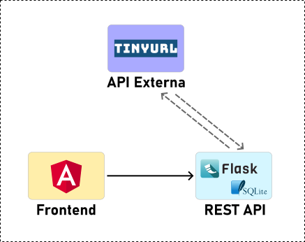

# Sweeter - Flask REST API

Projeto em Angular voltado para a criação de um tipo de microblog, ao estilo X (ex-Twitter).
Gerado com [Angular CLI](https://github.com/angular/angular-cli) versão 15.2.8.

## Docker

Para gerar a imagem do contêiner em Docker, execute o comando abaixo:

`docker build -t sweeter-angular .`

Depois de criada, verifique a existência da imagem executando `docker images`

Para executar o container da imagem criada, use o comando 

`docker run -p 4201:4200 sweeter-angular`

Feito isso, a aplicação estará disponível acessando-se a URL `http://localhost:4201/`